# VIDEOSHARE

<b>VideoShare</b> es un proyecto que se centra en la construción servicio en el cual sea posible crear concursos de videos, donde amigos, conocidos o cualquier persona que desee participar puede subir sus videos y comportirlos con los demás. Para ello <b>VideoShare</b> transforma los videos en formato ```.FLV```, ```.WMV``` y ```.AVI``` a ```.MP4```; cuando cada video esta listo, se envia una notificación al participante informandole que el proceso de transformación se ha llevado a cabo exitosamente y podrá ver el video en la página exclusiva de concurso.

* [1. Creación de Secreto](##1._Creación_de_Secreto)

# Guía de implementación

Esta página (README) es una guía práctica para la implementación del servicio VideoShare en configuración distribuida con auto-escalamiento mediante el proveedor de nube pública AWS. Esta configuración se constituye de mútiples componentes con sus respectivos servicios de AWS, los cuales se observan en la siguiente imagen:

**Arquitectura de solución VideoShare en AWS**:
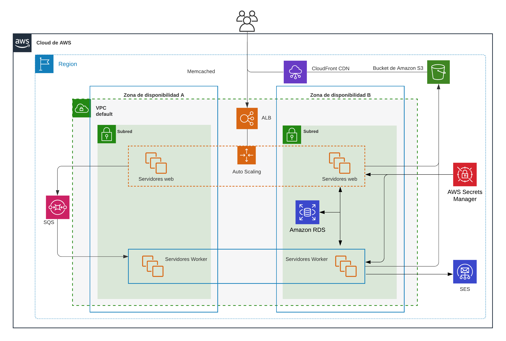

**Importante**: No se ha considerado las diferentes subredes requeridas (Pública, privada, datos).
Sin embargo, se recomienda hacer dicha consideración durante la implementación.
Componentes:

- Web
- Woker
- S3
- RDS
- ALB
- Auto Scaling
- SES
- SQS

Componentes adicionales a considerar (No se visualizan en el diagrama):

- Bastion (Para acceso a instancias en subredes privadas).
- NAT Gateway (Para facilitar instalación de dependencias para instancias en subredes
privadas).


Los siguientes pasos detallan el proceso de implementación del servicio VideoShare completamente distribuido y desacoplado mediante el uso de la consola de AWS. De antemano es importante mencionar que las **AMIs** [web-ami](web/README.md) y [worker-ami](workerjob/README.md) contienen el archivo **config.conf** con los siguientes valores.

* **web-ami:**

```ruta: /home/admin/videoshare/config.conf```

```TOML
[SECRETS]
name = videoshare/develop/config
region = us-east-1
```

* **worker-ami:**

```ruta: /home/admin/workerjob/config.conf```

```TOML
[SECRETS]
name = videoshare/develop/config
region = us-east-1

[FFMPEG]
ffmpeg = ffmpeg 
#ffmpeg_args = -strict -2
```

**Nota Importante:** el valor de ```region``` de la sección ```SECRETS``` al interior de los archivos de configuración **config.conf** hace referencia a la región donde se realizará el despliegue conjunto de todo el servicio VideoShare, de tal forma que si se requiere el uso de una región diferente a Norte de Virginia se debe realizar dicho ajuste y se recomienda actualizar las AMIs.

## 1. Creación de Secreto

Lo primero que debemos hacer es la creación de un secreto mediante el uso del servicio [Secret Manager](https://console.aws.amazon.com/secretsmanager/home?region=us-east-1#!/listSecrets). Para ello haremos click sobre **```Store a new secret```** y daremos inicio a una serie de 4 pasos para la definición total del secreto.

El _primer paso_ consiste en seleccionar el tipo de secreto (**Select secret type**), para ello vamos a seleccionar **```Other type of secrets```**, el cual nos permitirá almacenar la mayor parte de las configuraciones de nuestra implementación del servicio VideoShare. De manera inmediata podemos registrar los valores de nuestro secreto (**key/value pairs**), mediante la opción **```Secret Key/Value```** o **```PlainText```**; por efectos prácticos sugerimos usar la opción **```PlainText```** y pegar allí el siguiente JSON:

```json
{
    "web_url": "",
    "web_port": "",
    "rds_url": "",
    "rds_port": "",
    "rds_user": "",
    "rds_pass": "",
    "rds_db": "",
    "sqs_url": "",
    "s3_url": "",
    "cf_url": "",
    "ses_email": "",
    "splunk_api_url": "",
    "splunk_api_port": "",
    "splunk_api_protocol": "",
    "splunk_api_token": "",
    "splunk_index": "",
    "splunk_source": "",
    "splunk_sourcetype": ""
}
```

_**Nota Importante**: En el JSON anterior solamente encontramos los nombres de las llaves puesto que los valores deberán ser almacenados a medida que avanzamos en la implementación de los servicios adicionales._

El segundo paso consiste en la definición del nombre del secreto, para ello recomendamos fuertemente el uso del siguiente nombre: "**videoshare/develop/config**" puesto que las **AMIs** [web-ami](web/README.md) y [worker-ami](workerjob/README.md) se encuentran preconfiguradas con dicho nombre de secreto. Sin embargo, si se desea realizar cambio del nombre del secreto o de la región de despliegue del servicio, es necesario modificar el archivo **config.conf** y crear nuevas las dos AMIs a partir de este cambio.

Desde este punto podemos dejar las configuraciones por defecto que nos entrega la consola de AWS para los siguientes 2 pasos, done es posible establecer rotación automática, políticas del recurso y réplicas de este secreto.

## 2. Crear almacenamiento S3

Este paso consiste en la [creación de un bucket S3](https://s3.console.aws.amazon.com/s3/bucket/create) el cual almacenará todos los videos originales, los videos transformados junto con las imágenes extraídas y las imágenes de los concursos, para ello se requiere únicamente de la definición del nombre (único global) y de establecer las configuraciones de acceso público a este.
 
Puesto que el bucket S3 será el origen de nuestra distribución de CloudFront, resulta práctico deshabilitar todo el bloqueo de acceso público en la sección denominada Block Public Access settings for this bucket como se observa a continuación:

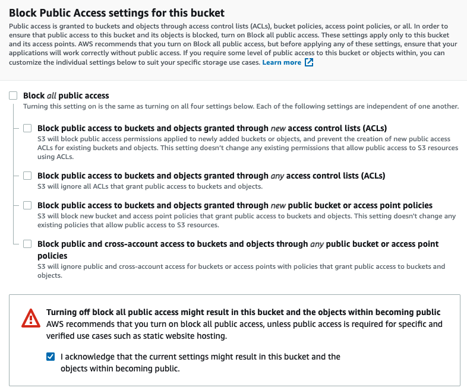

Sin embargo, es posible mejorar la seguridad de nuestra solución realizando la implementación de OAI ([Origin Access Identity](https://docs.aws.amazon.com/AmazonCloudFront/latest/DeveloperGuide/private-content-restricting-access-to-s3.html)), con lo cual creamos un usuario para que se garantice el acceso a los objetos almacenados en el bucket S3 mediante la distribución Cloudfront sin garantizar acceso directo a nuestro bucket, justo como se observa a continuación:

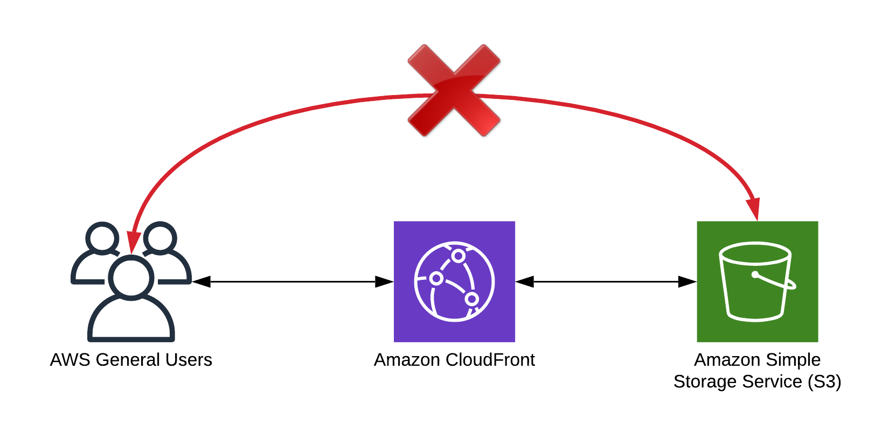

**Actualización de Secreto:** En este punto procedemos a almacenar el nombre de nuestro bucket en el secreto previamente creado: 
```json
"s3_url":"<nombre de nuestro bucket>"
```

* **Ejemplo:**

    ```MyVideoShareBucket```

## 3. Crear CloudFront Distribution

En este paso vamos a crear la distribución necesaria para entregar el contenido del servicio. Para ellos vamos a dirigirnos a [este enlace](https://console.aws.amazon.com/cloudfront/v3/home#/distributions/create) y comenzar la creación de la distribución.

Lo primero que debemos hacer es especificar el dominio de nuestro bucket y el nombre del origen, el cual, por defecto, será autocompletado por la consola de AWS con el mismo valor del dominio del bucket.

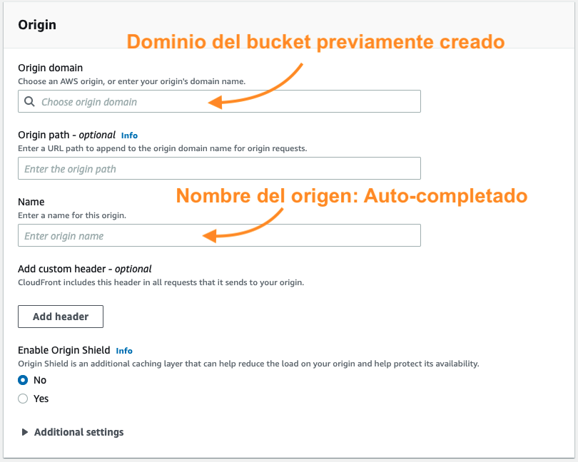

Una vez tenemos los valores anteriores definidos, podemos finalizar la creación de la distribución, dejando los demás campos como se encuentran por defecto en la consola de AWS.


**Actualización de Secreto:** En este punto procedemos a almacenar el subdominio de nuestra distribución en el secreto previamente creado:
 ```json
"cf_url":"<nombre del subdominio de nuestro origen>"
````
En la consola de AWS podemos ver esto en la columna **Domain name**.

```<nombre del subdominio de nuestro origen>.cloudfront.net```

* **Ejemplo:**

    Si el valor de **Domain name** es el siguiente ```5sRrs3wsefd.cloudfront.net```, en el secreto debemos almacenar solamente ```5sRrs3wsefd```.

## 4. Crear sistema de colas

Para este paso debemos dirigirnos a [este enlace](https://console.aws.amazon.com/sqs/v2/home) e iniciar a la creación de una cola en **```Create Queue```**. De manera inmediata, en el apartado de **Details**, seleccionamos **Standard** y asignamos el nombre a de la cola SQS.

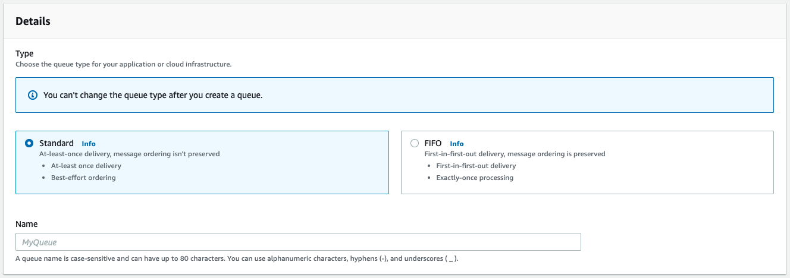

Posteriormente, en el apartado de **Configuration**, establecemos el tiempo de visibilidad (**Visibility timeout**), donde se sugiere que este valor sea superior a un par de minutos, puesto que se refiere al tiempo en el que un mensaje no será visible para los consumidores (workers) de la cola después de que otro consumidor lo ha solicitado.

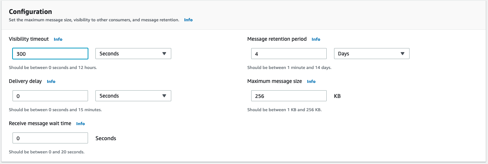

Para un diseño riguroso, el valor de **Visibility timeout** deberá contemplar el tiempo de transcoding de los videos por parte de la capa worker, e.i. Máximo tiempo estimado.

**Actualización de Secreto:** En este punto procedemos a almacenar la URL de nuestra cola SQS en el secreto previamente creado: 

```json
"sqs_url":"<url de la cola SQS>"
```

* **Ejemplo:**

    ```https://sqs.us-XXXX-X.amazonaws.com/XXXXXXXXXX/my-videoshare-queue```


## 5. Crear RDS (MySQL)

En este paso realizamos la creación de una RDS MySQL siguiendo los pasos que se especifican en [este enlace](https://docs.aws.amazon.com/AmazonRDS/latest/UserGuide/USER_CreateDBInstance.html).

Actualización de Secreto: Procedemos a almacenar la URL de la base de datos, el puerto de acceso, el nombre del usuario, la contraseña y el nombre de la base de datos en el secreto previamente creado:
```json
"rds_url":"<url de la base de datos>",
"rds_port":"<puerto>",
"rds_user":"<usario con permisos de lectura y escritura>",
"rds_pass":"<password>",
"rds_db":"<nombre de la base de datos>"
```

En este punto debemos crear una instancia web ([web-ami](web/README.md)) temporal, ingresar a la instancia y ejecutar:

```shell
cd videoshare
source vsvenv/bin/activate
python manage.py collectstatic
python manage.py makemigrations
python manage.py migrate
```

## 6. Envío de email

Este paso consiste en la verificación de los e-mails empleados para las pruebas. Para ello vamos a dirigirnos al servicio **SES** y especificar los e-mails en el apartado Email Addresses:

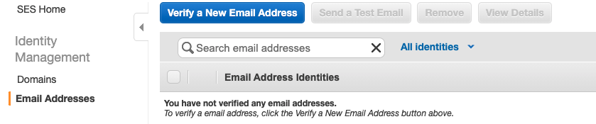

Una vez se registran los e-mails, debemos validar los correos de verificación que AWS nos enviará.

## 7. Creación de Roles

Procedemos a la [creación de 2](https://console.aws.amazon.com/iam/home#/roles$new?step=type) roles para otorgar permisos tanto a las instancias web como a las worker para poder acceder a los servicios previamente definidos.

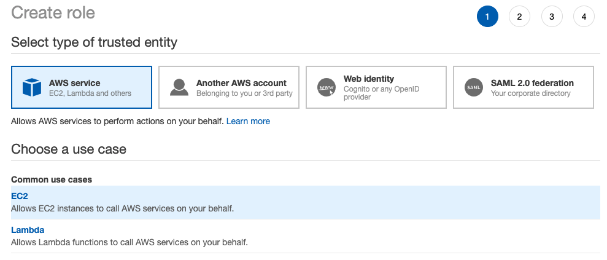

Posteriormente, podemos seleccionar las políticas asociadas a cada rol,  para ello seleccionaremos las siguientes políticas para el primer rol, el cual estará asociado a las instancias web.

* **SecretsManagerReadWrite:**
    
    ```arn:aws:iam::aws:policy/SecretsManagerReadWrite```

* **AmazonSQSFullAccess:**
    
    ```arn:aws:iam::aws:policy/AmazonSQSFullAccess```

* **AmazonS3FullAccess:** 
    
    ```arn:aws:iam::aws:policy/AmazonS3FullAccess```

Después de seleccionar las políticas mencionadas, continuamos con la definición del rol y asignamos el nombre correspondiente. Sugerencia de nombre: ```WEB_S3-SQS-SecretManager```.

Este proceso se debe ejecutar nuevamente para la creación del rol para las instancias  worker. En este caso se deben asignar las siguientes políticas durante la creación del rol. 

* **SecretsManagerReadWrite:**

    ```arn:aws:iam::aws:policy/SecretsManagerReadWrite```

* **AmazonSQSFullAccess:** 

    ```arn:aws:iam::aws:policy/AmazonSQSFullAccess```

* **AmazonS3FullAccess:** 

    ```arn:aws:iam::aws:policy/AmazonS3FullAccess```

* **AmazonSESFullAccess:** 
    
    ```arn:aws:iam::aws:policy/AmazonSESFullAccess```

Sugerencia de nombre: ```WORKER-S3-SQS-SecretManager-SES```.

## 8. Grupos de Seguridad
	
En este punto debemos crear los Security Groups y permitir la comunicación entre el ALB y las instancias Web y entre la base de datos y las instancias Web y worker.

## 9. Launch Configuration Web

En este paso creamos la [configuración de despliegue](https://console.aws.amazon.com/ec2/v2/home?region=us-east-1#CreateLaunchConfiguration) de instancias **EC2** para la capa web, para ello hacemos uso de la **AMI** **AMIs** [web-ami](web/README.md), establecemos el tipo de instancia, el  rol con las políticas apropiadas (WEB_S3-SQS-SecretManager, definido en el paso 7) y definimos el security grupo con los accesos de entrada requeridos.

## 10. Autoescalamiento web

Es importante aclarar que algunos de los servicios a implementar se crearán durante el proceso de implementación del servicio de autoescalamiento, para ello nos podemos dirigir a [Autoscaling Group](https://console.aws.amazon.com/ec2autoscaling/home). 

Desde este instante seleccionamos la configuración de despliegue de instancias web que creamos en el paso anterior y asignamos un nombre a nuestro grupo de autoescalamiento.

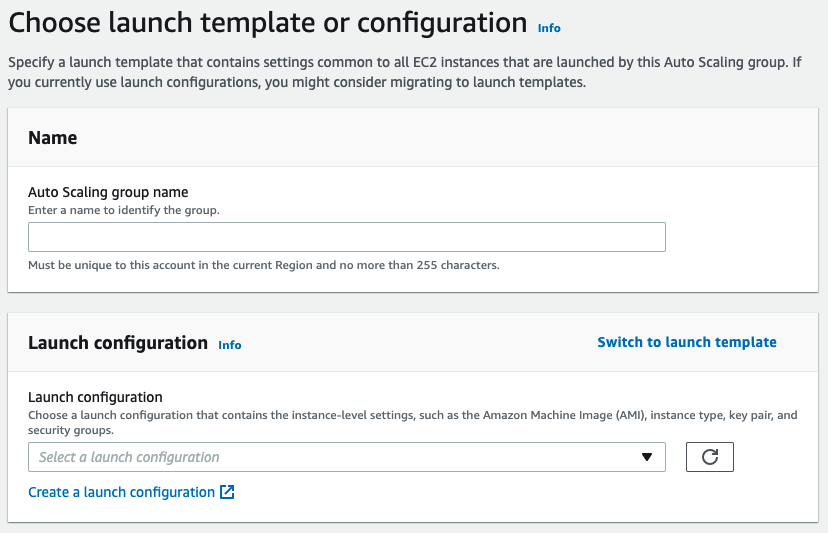

Posteriormente,  seleccionamos la VPC que vamos a usar para el despliegue de nuestras instancias al igual que las subredes correspondientes (Subredes públicas).

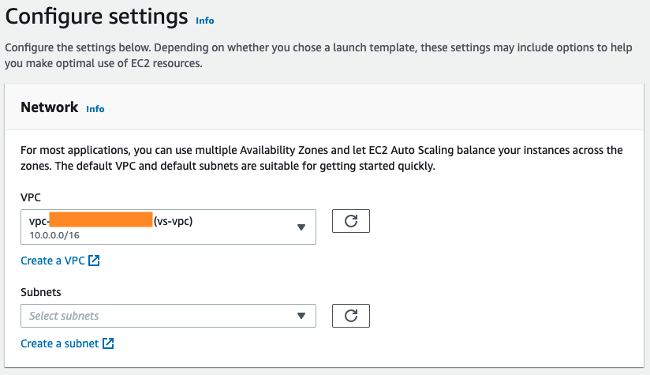

En el siguiente paso seleccionamos "_adjuntar un nuevo balanceador de carga_", de tal forma que nuestra aplicación web se pueda servir a través un **Application Load Balancer**.

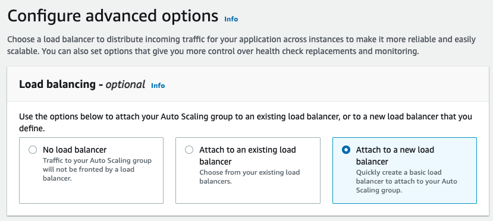

Aquí crearemos el **Application Load Balancer**, el cual permitirá realizar balanceo de carga a través de múltiples instancias Web. Para ello vamos a seguir los pasos que se indican en la consola de AWS y nos llevará a la creación de un **listener** y un **target group**. 

De esta forma podremos especificar en el **listener** que el puesto de escucha es el 80 y que el redireccionamiento se hace hacia al puerto 8080. De esta manera las instancias web que incorporamos en el **target group** recibirán el tráfico por el puerto apropiado.

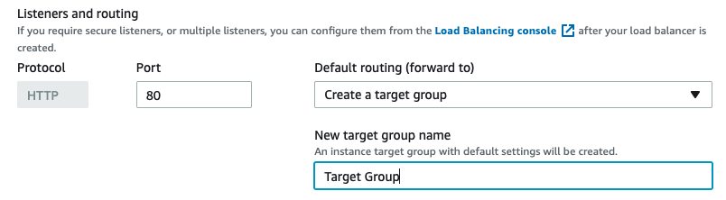

En este punto podemos asignar el tipo de Health Check, el cual lo haremos a través del Elastic Load Balancer (ELB) implementado, en este caso un **Application Load Balancer**.

Ya podemos definir el tamaño deseado de nuestro grupo (Group Size) de autoescalamiento y el número de instancias máximas y mínimas requeridas para desplegar nuestra capa web. 

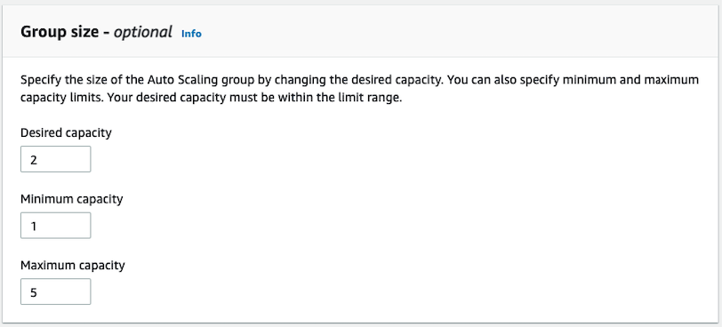

Posteriormente, en el apartado de políticas de escalamiento (**Scaling policies**) seleccionamos la opción **```Target Tracking scaling policy```**, seleccionamos la métrica deseada, en este caso utilización de la CPU y finalmente establecemos el valor medio esperado de utilización de CPU.

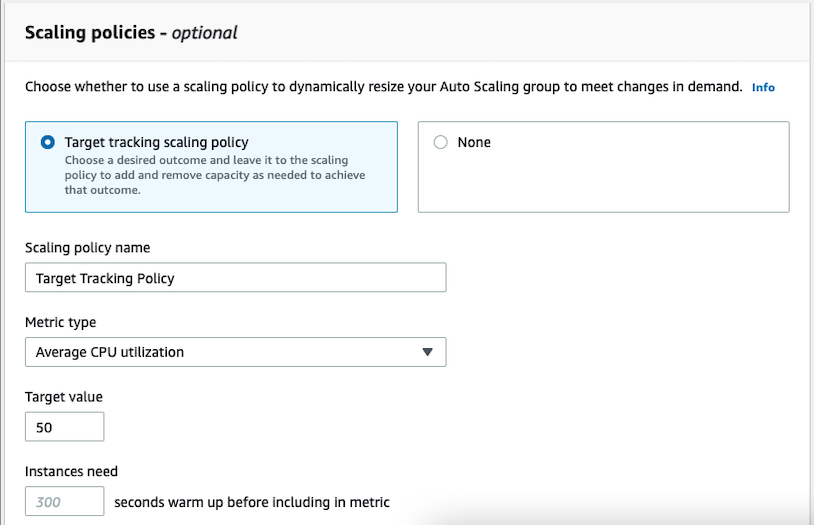

A partir de este punto podemos continuar con la configuración como se encuentra en la consola de AWS y terminar la configuración de nuestra capa web.

## 11. Creación de Instancia worker

Para la capa worker vamos a hacer uso de la imágen [worker-ami](workerjob/README.md), de tal forma que podemos crear una o múltiples instancias worker para el procesamiento de videos. Si tenemos todos los servicios definidos correctamente y los secretos completamente definidos, los worker desarrollarán el procesamiento de videos sin problema alguno.

## 12. Validación

En este punto ya es posible realizar la validación del servicio VideoShare, verificando la exposición de la web a través del **ALB** y verificando la transformación de los videos.

**Nota:** El **ALB** se puede asociar a un dominio mediante un **Alias Record** con **Route 53**.


## Comentarios adicionales: 

En función de la **VPC** a implementar en este proyecto (default u otra), debemos o no crear un **VPC Endpoint** de tipo **Gateway** para asegurar el acceso a S3 mediante conexión privada de AWS para las instancias que se encuentren al interior de la VPC, de tal manera que el acceso a los objetos no suceda a través de internet mediante un **IGW** (Internet Gateway).